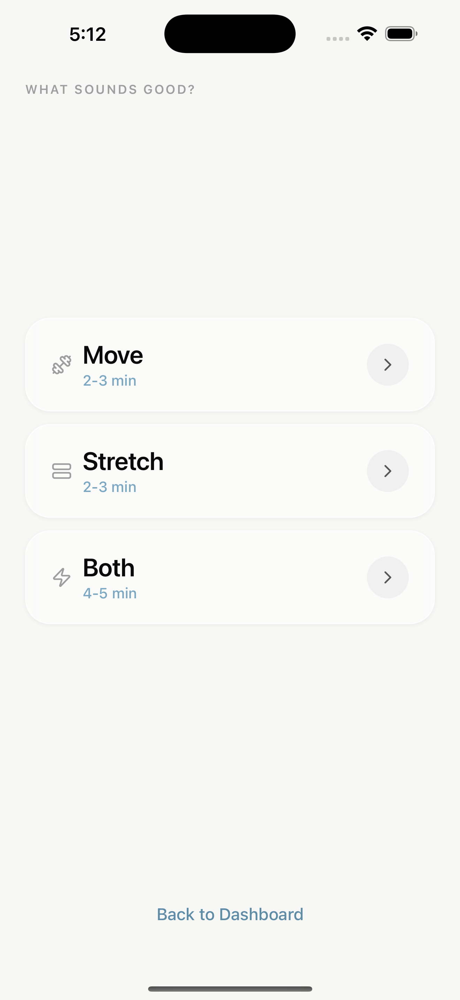
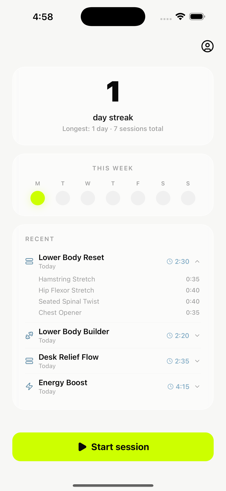
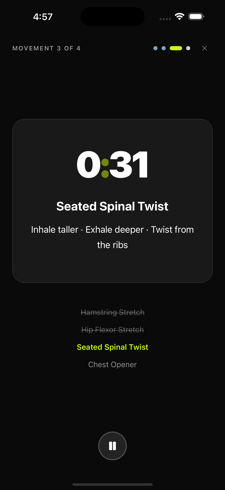
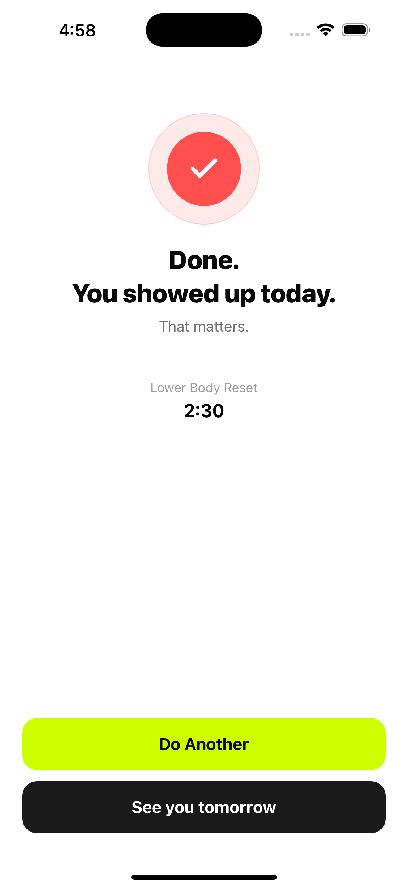

# LowLift Fitness

> A fitness app built for the **first ten reps, not the next PR** — designed for absolute beginners, post-injury returns, and the gym-shy that mainstream fitness apps actively scare off.

Most fitness apps assume a 30-minute baseline on day one. LowLift starts at 8 minutes, seated-friendly, with **soft streaks** that don't punish missed days and no bodies, scales, or before/after photos anywhere. Anti-shame is a product commitment, not a feature.

📱 **iOS** · built solo, end-to-end · [Case study](https://taylorp.me/case-lowlift-v2)

## Screenshots

| Onboarding | Dashboard | Session player | Completion |
|---|---|---|---|
|  |  |  |  |

## Tech stack

- **App:** Expo SDK 54 · React Native 0.81 · React 19 · TypeScript
- **Backend:** Supabase — PostgreSQL, Auth, Row-Level Security, Edge Functions
- **Motion/UI:** React Native Reanimated, Gesture Handler, Lucide icons
- **Notifications:** `expo-notifications` (gentle once-a-week nudges, by design)
- **Secure storage:** `expo-secure-store`

## Features

- Honest onboarding that treats "it's been a while" as the default, not a failure
- Movement library with attempt tracking
- Daily Challenge, favorites, and session player
- Soft streaks (miss a day, keep the streak)
- Auth, password reset, and account deletion (Apple requirement) via a Supabase Edge Function

## Project structure

```
app/         Expo (React Native) application — screens, components, lib
supabase/
  migrations/   SQL schema (0001_init, 0002_movements_and_attempts)
  functions/    delete-account edge function
docs/        Privacy policy + privacy site
screenshots/ App Store screenshots
```

## Run it locally

```bash
cd app
npm install
cp .env.example .env      # add your Supabase URL + anon key
npm run ios               # or: npm run android / npm run web
```

Requires the [Expo](https://expo.dev) toolchain. Supabase schema lives in `supabase/migrations`.

---

Built end-to-end (strategy → design → code) by [Taylor Pangilinan](https://taylorp.me).
